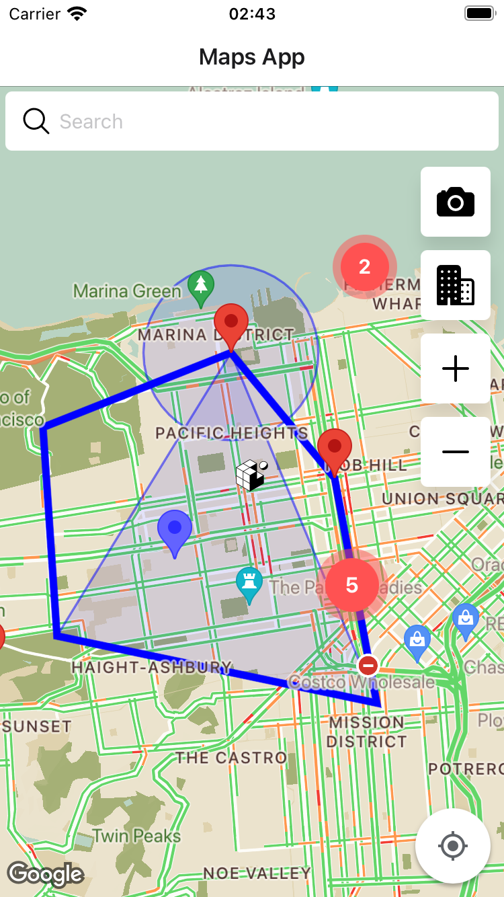

# React Native Map Application

This README document provides a comprehensive overview of a React Native application designed to showcase advanced mapping functionalities, including the use of custom markers, polygons, polylines, circles, and integration with Google Places Autocomplete for location search. The app employs the `react-native-maps` library for map rendering and the `expo-file-system` and `expo-sharing` for snapshot functionalities.

## App Showcase

Here's a look at the app in action:

<p align="center">
  
  
</p>

## Features

- **Google Places Autocomplete**: Search functionality to find places and zoom into the selected location on the map.
- **Map Clustering**: Utilizes `react-native-map-clustering` for efficient handling of multiple markers on the map.
- **Custom Map Styling**: Incorporates a custom map style defined in `mapStyle` for a unique look and feel.
- **Markers and Geometries**: Demonstrates the use of markers (including custom colors and images), polylines, circles, and polygons to represent geographical data.
- **Interactive Elements**: Features interactive markers with callouts and programmable buttons to manipulate map views (zoom in/out, focus on a specific region).
- **Snapshot and Sharing**: Implements functionality to take a snapshot of the current map view and share it using the device's sharing options.

## Getting Started

### Prerequisites

Ensure you have the following installed:

- Node.js and npm (or Yarn)
- Expo CLI
- An IDE or editor of your choice (e.g., Visual Studio Code)

### Installation

1. Clone the repository to your local machine.
2. Navigate to the project directory and install dependencies:

   ```sh
   npm install
   # or
   yarn install
   ```

3. Start the development server:

   ```sh
   # iOS:
   npx expo run:ios
   # Android:
   npx expo run:android
   ```

4. Follow the instructions in the terminal to open the app on your device or emulator.

### Environment Variables

- `EXPO_PUBLIC_GOOGLE_PLACES_API_KEY`: Set this environment variable with your Google Places API key to enable the search functionality.

## Usage

Upon launching the app, you can search for places using the Google Places Autocomplete input field. Interact with the map to explore different features such as zooming, focusing on specific regions, and viewing details of custom markers. Use the buttons provided to take a snapshot of the map and share it, or to adjust the map view.

## Contributing

Contributions are welcome! Please feel free to submit pull requests with new features, improvements, or bug fixes.

## License

This project is licensed under the MIT License - see the LICENSE file for details.

## Acknowledgments

- `react-native-maps` and `expo` libraries for providing the core functionalities.
- Google Places API for location search capabilities.
